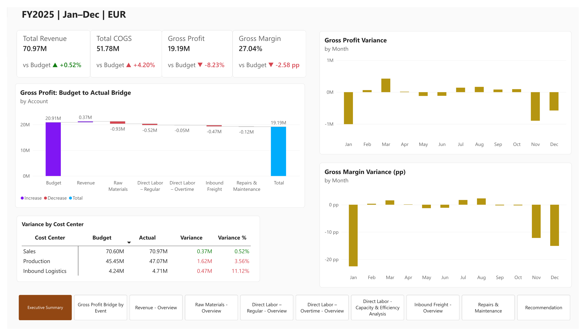
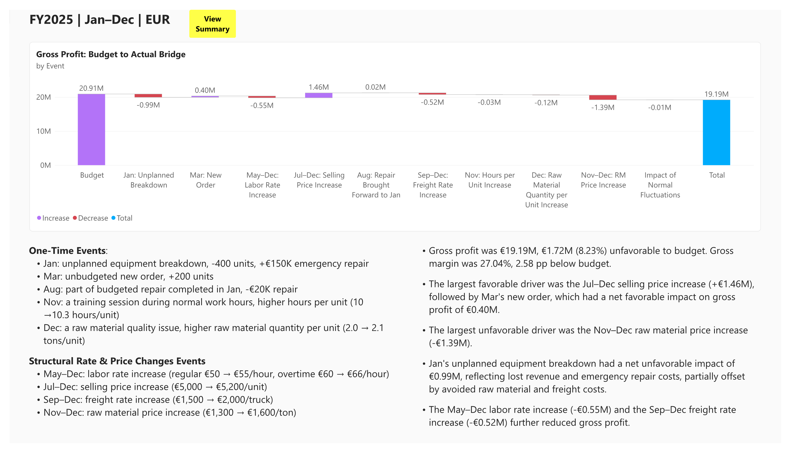
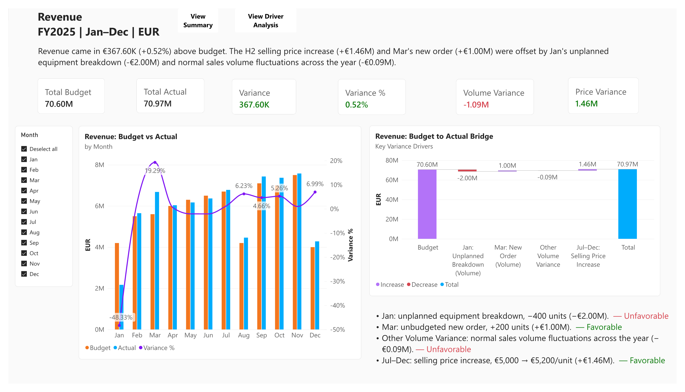
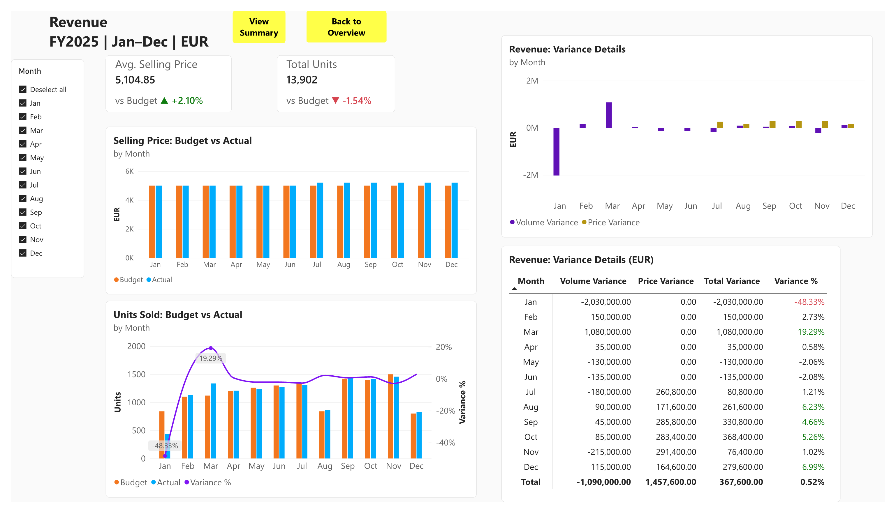
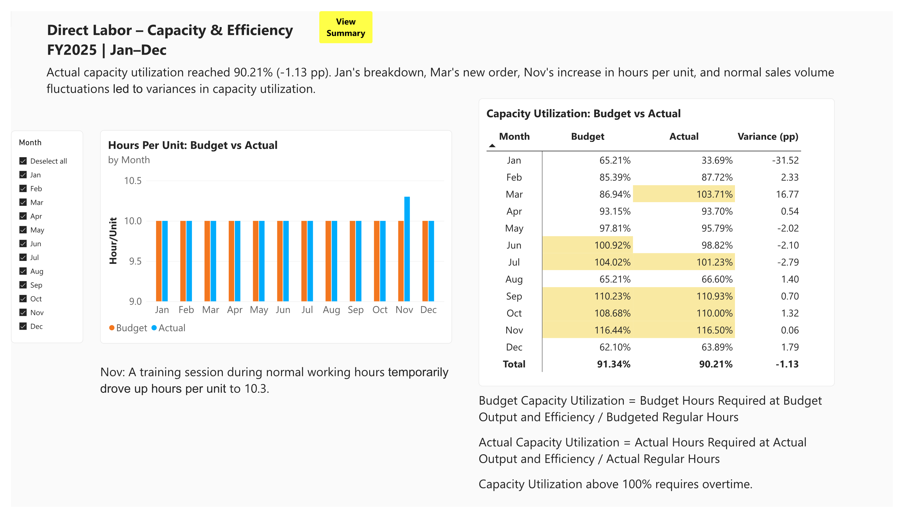
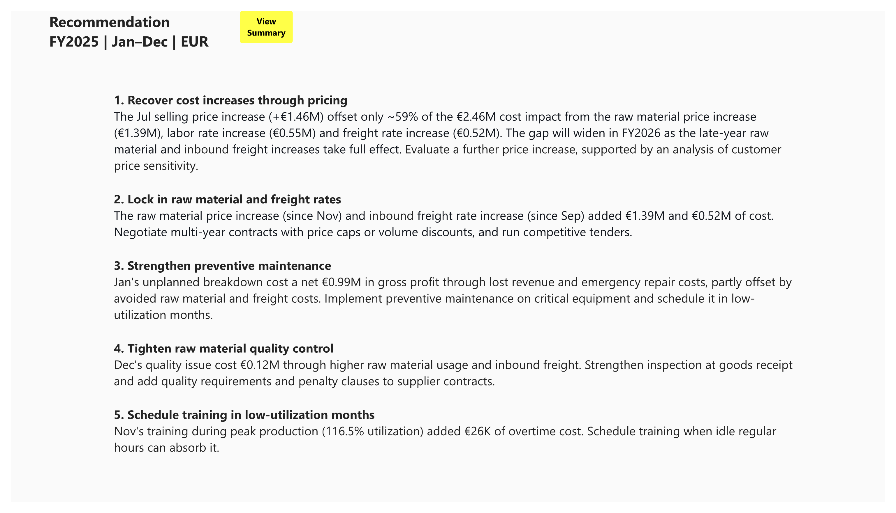
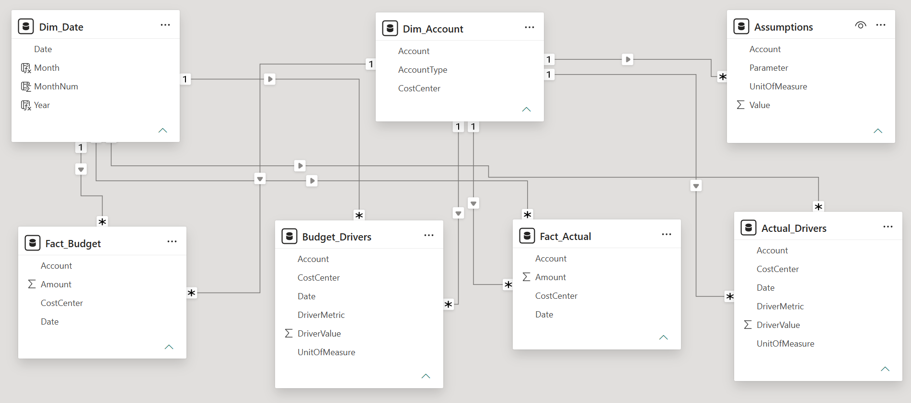
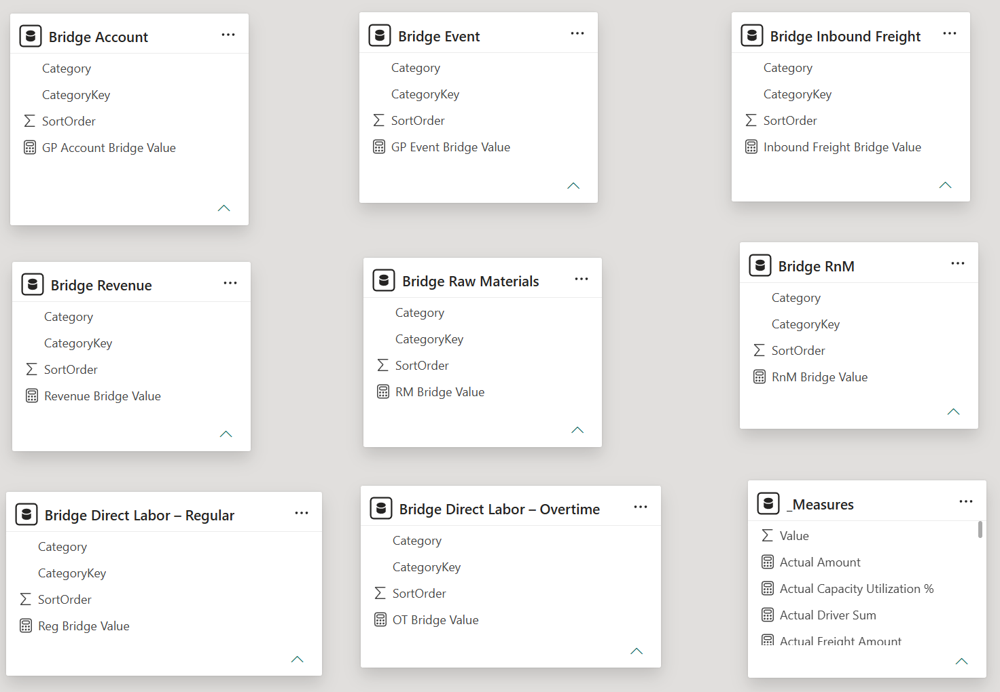

# Budget vs Actual Variance Analysis — Power BI Dashboard

> **⚠️ Data Source:** All data in this project is **synthetic and fictional**, generated with Python to simulate a realistic manufacturing budget-vs-actual scenario. It does not represent any real company or real financial results. The budget was also rebuilt independently in Excel.

A Power BI dashboard analyzing budget-to-actual performance for a simulated manufacturing company (FY2025, EUR), using standard costing variance analysis (Price / Rate / Volume / Usage / Efficiency / Activity Variance) across Revenue, Raw Materials, Direct Labor, Inbound Freight, and Repairs & Maintenance.

**Key Results** 

1. Gross profit was €19.19M, €1.72M (8.23%) unfavorable to budget. Gross margin was 27.04%, 2.58 pp below budget. 
2. The largest favorable driver was the Jul–Dec selling price increase (+€1.46M), followed by Mar's new order, which had a net favorable impact on gross profit of €0.40M. 
3. The largest unfavorable driver was the Nov–Dec raw material price increase (-€1.39M). 
4. Jan's unplanned equipment breakdown had a net unfavorable impact of €0.99M, reflecting lost revenue and emergency repair costs, partially offset by avoided raw material and freight costs. 
5. The May–Dec labor rate increase (-€0.55M) and the Sep–Dec freight rate increase (-€0.52M) further reduced gross profit.

**[View the full report (PDF)](budget_vs_actual.pdf)**

## Dashboard Preview

The remaining pages are in the [PDF](budget_vs_actual.pdf).

## Project Overview

This project has two parts:

1. **Building the budget** — the budget was constructed bottom-up from a sales volume plan, a budgeted selling price and standard cost assumptions (raw materials price, hours per unit, quantity per unit, etc.). Revenue and Raw Materials scale with sales volume. Inbound Freight scales indirectly, via raw material quantity. Direct Labor – Overtime is incurred only when required hours exceed regular capacity. Two accounts are volume-independent: Direct Labor – Regular, a fixed capacity cost (headcount × standard hours × rate), and Repairs & Maintenance, a fixed operating budget.
2. **Simulating actuals and analyzing variances** — actual results were generated on top of the budget by introducing random monthly fluctuations plus realistic business events (an equipment breakdown, rate increases, a raw material quality issue, etc.), and the resulting variances were analyzed and visualized in Power BI.

**Scope:** rather than covering the full income statement, this project focuses on six core accounts: Revenue, Raw Materials, Direct Labor (Regular & Overtime), Inbound Freight, and Repairs & Maintenance. Each account is analyzed with a variance methodology that fits how that cost behaves.

**Notation:** "Units" = sales volume. "Budget Units" and "Budget Selling Price" are the budgeted sales volume and price. "Standard" refers to the price and quantity standards the budget is built on. Every "Actual X" uses that month's actual price/rate/ratio.

## Report Pages

Most accounts follow a two-page pattern: an **Overview** page (monthly Budget-vs-Actual trend for the account total + Budget-to-Actual waterfall + variance KPIs) followed by a **Driver Analysis** page (monthly Budget-vs-Actual trends for the underlying drivers, e.g. price, volume, rate + full monthly variance detail + driver-level KPIs).

| Section | Pages | What's Covered |
|---|---|---|
| **Executive Summary** | 1 | Company-wide KPIs (Revenue, COGS, Gross Profit, Gross Margin); Gross Profit Bridge (Budget to Actual) by Account; Variance by Cost Center; Gross Profit and Gross Margin Variance by Month |
| **Gross Profit Bridge by Event** | 1 | Gross Profit Bridge (Budget to Actual) by Business Event |
| **Revenue** | 2 | Volume/Price Variance KPIs; Budget to Actual Bridge; Selling Price, Units Sold, and full monthly variance detail |
| **Raw Materials** | 3 | Activity/Usage/Price Variance KPIs; Budget to Actual Bridge; Price, Quantity per Unit, Usage, and full monthly variance detail |
| **Direct Labor – Regular** | 2 | Variance KPIs; Budget to Actual Bridge; Rate, Hours, and full monthly variance detail |
| **Direct Labor – Overtime** | 2 | Activity/Labor Efficiency/Labor Rate Variance KPIs; Budget to Actual Bridge; OT Rate, Hours, and full monthly variance detail |
| **Direct Labor – Capacity & Efficiency** | 1 | Hours per Unit and Capacity Utilization variance detail |
| **Inbound Freight** | 2 | Activity, Raw Material Quantity per Unit Impact and Rate Variance KPIs; Budget to Actual Bridge; Freight Rate, Truckload Count, and full monthly variance detail |
| **Repairs & Maintenance** | 1 | KPIs; Budget to Actual Bridge; full monthly detail table |
| **Recommendation** | 1 | Five actions based on the variance drivers identified above |

## Business Assumptions

The simulated manufacturing company is simplified along the following lines:

- **Single product, single raw material** — the company manufactures and sells a single product made from a single type of raw material.
- **Uniform prices and rates, no mix effect** — within any given month, there is one selling price, one raw material price and one freight rate. No customer, supplier or carrier dimension is modeled, so Price and Rate variances are not affected by mix.
- **Step changes, single currency** — prices and rates change as one-off step changes in a defined month, and all amounts are in EUR, with no FX or inflation effects.
- **Zero inventory** — there is no raw material or finished-goods inventory buffer. Monthly production equals monthly sales, and the raw material purchased and shipped each month exactly matches that month's production need.
- **Direct Labor – Regular is a fixed capacity cost** — headcount and regular hours are fixed. Overtime is a variable cost incurred only when required hours exceed regular capacity, paid at a constant 1.2× the regular rate, and is assumed unconstrained.
- **Inbound freight is billed per Full Truckload (FTL)** — it covers only inbound raw material shipping. Even a partially filled truck is billed as a full truckload.
- **Repairs & Maintenance is a fixed cost** — it follows a fixed monthly schedule (including a planned major repair in Aug) and does not vary with sales volume.
- **Limited cost scope** — Total COGS = Raw Materials + Direct Labor (Regular + Overtime) + Inbound Freight + Repairs & Maintenance.
- **Normal fluctuations** — in the simulated actuals, sales volume and Repairs & Maintenance cost fluctuate randomly within ±3% of budget before event adjustments. All other drivers (prices, rates, usage per unit) follow budget except for the events listed in the dashboard.

## Data Model

The model follows a **star schema**. `Fact_Budget` and `Fact_Actual` each hold one row per Date × CostCenter × Account, storing an Amount. `Budget_Drivers` and `Actual_Drivers` each hold one row per Date × CostCenter × Account × DriverMetric (e.g., Quantity, Unit Price), storing a DriverValue and its UnitOfMeasure (e.g., Units, EUR/Unit). `Actual_Drivers` also contains four `KnownEvent` rows (Jan and Mar sales volume changes, Jan and Aug repair cost adjustments). All four relate to `Dim_Date` and `Dim_Account` via single-direction, one-to-many relationships. `Assumptions` holds parameters (headcount, truck capacity) not tied to the monthly grain.

`Fact_Budget`, `Fact_Actual`, `Budget_Drivers`, `Actual_Drivers` and `Assumptions` are loaded directly from the sheets of the same name in `Budget_Actual.xlsx`. `Dim_Account` is loaded from the Cost Center sheet, and `Dim_Date` is a calendar table created in Power BI.

Eight disconnected bridge tables (from `DAX_measures_and_user_defined_functions.xlsx`) give the step names and sort order for the waterfall charts. They have no relationships to the star schema.

## Methodology

### 1. Budget Construction

| Account | Budget Formula |
|---|---|
| Revenue | Budget Units × Budget Selling Price (€5,000/unit) |
| Raw Materials | Budget Units × Standard Quantity per unit (2 ton/unit) × Standard RM Price (€1,300/ton) |
| Direct Labor – Regular | Regular Capacity Hours (85 workers × 35 hours/week × 4.33 weeks ≈ 12,882 hours) × Standard Regular Rate (€50/hour) |
| Direct Labor – Overtime | max(Budget Units × Standard Hours per Unit (10 hours/unit) − Regular Capacity Hours, 0) × Standard OT Rate (€60/hour) |
| Inbound Freight | ROUNDUP(Budget Units × Standard Quantity per unit ÷ Truck Capacity (10 ton/truck)) × Standard Freight Rate (€1,500/truck) |
| Repairs & Maintenance | €54,000/month; August is €108,000, including a planned major repair. |

*The budget was built both in the Python script and in Excel (`Budget_Model.xlsx`).*

### 2. Actual Data Generation

**Baseline random fluctuation:**
- Actual monthly sales volume = Budget volume × (1 ± up to 3% random noise)
- Actual monthly Repairs & Maintenance = Budget amount × (1 ± up to 3% random noise)

Random noise of up to ±3% simulates normal fluctuation: actual sales volume and repair costs rarely match budget exactly, even without a specific cause.

**Business events layered on top of the random noise:**

| Month | Event |
|---|---|
| Jan | Unplanned equipment breakdown: sales volume down 400 units; +€150,000 emergency repair cost |
| Mar | Unbudgeted new order: sales volume up 200 units |
| May → Dec | Labor rate increase: regular €50→€55/hour, overtime €60→€66/hour |
| Jul → Dec | Selling price increase: €5,000→€5,200/unit |
| Aug | Part of the budgeted repair (€20,000) had been completed during Jan's emergency repair, reducing Aug's actual repair cost by €20,000 |
| Sep → Dec | Freight rate increase: €1,500→€2,000/truck |
| Nov | Workers attended a training session during normal work hours: hours per unit temporarily rose from 10 to 10.3 hours/unit (Nov only) |
| Nov → Dec | Raw material price increase: €1,300→€1,600/ton |
| Dec | Raw material quality issue occurred: raw material quantity per unit rose from 2 to 2.1 tons/unit (Dec only) |

**Actual cost formulas:**

| Account | Actual Formula |
|---|---|
| Revenue | Actual Units × Actual Selling Price |
| Raw Materials | Actual Units × Actual Quantity per Unit × Actual RM Price |
| Direct Labor – Regular | Actual Regular Hours × Actual Regular Rate |
| Direct Labor – Overtime | max(Actual Units × Actual Hours per Unit − Regular Capacity Hours, 0) × Actual OT Rate |
| Inbound Freight | ROUNDUP(Actual Units × Actual Quantity per Unit ÷ Truck Capacity) × Actual Freight Rate |
| Repairs & Maintenance | Budget amount ± random noise ± one-off events (Jan emergency repair, Aug offset)|

*Actual Regular Hours equals Regular Capacity Hours. Truck Capacity remains the same for both budget and actual data.*

*The actual data was built in the Python script.*

### 3. Variance Analysis (Power BI Dashboard)

Each account's total variance is decomposed into interpretable variance components. These components are shown throughout the dashboard using visuals such as KPI cards, budget-to-actual bridge (waterfall) charts, and monthly trend charts. Each variance is traced back to the underlying business event and normal month-to-month fluctuation. 

| Account | Variance Components |
|---|---|
| Revenue | Volume, Price |
| Raw Materials | Activity, Usage, Price |
| Direct Labor – Regular | Labor Rate |
| Direct Labor – Overtime | Activity, Labor Efficiency, Labor Rate |
| Inbound Freight | Activity, Raw Material Quantity per Unit Impact, Rate |
| Repairs & Maintenance | Not decomposed — variance attributed directly to one-off events |

📐 Click to expand exact variance formulas for all accounts

All variance components are calculated at monthly grain (SUMX over Dim_Date[Month]) and then summed, so annual totals equal the sum of the twelve monthly variances.

#### Revenue:
- **Volume Variance** = (Actual Units − Budget Units) × Budget Selling Price
- **Price Variance** = Actual Units × (Actual Selling Price − Budget Selling Price)
- **Revenue Variance** = Volume Variance + Price Variance

#### Raw Materials
- **Activity Variance** = (Actual Units − Budget Units) × Standard Quantity per Unit × Standard RM Price
- **Usage Variance** = Actual Units × (Actual Quantity per Unit − Standard Quantity per Unit) × Standard RM Price
- **Price Variance** = Actual Units × Actual Quantity per Unit × (Actual RM Price − Standard RM Price)
- **Raw Materials Variance** = Activity Variance + Usage Variance + Price Variance

#### Direct Labor – Regular
- **Labor Rate Variance** = Actual Regular Hours × (Actual Regular Rate − Standard Regular Rate)
- **Direct Labor – Regular Variance** = Labor Rate Variance
- No Activity or Efficiency variance: Direct Labor – Regular is a fixed capacity cost, so paid Regular Hours are fixed at capacity in both budget and actual, regardless of output or efficiency.

#### Direct Labor – Overtime
- **OT Hours at Standard Efficiency** = MAX(0, Actual Units × Standard Hours per Unit − Regular Capacity Hours)
- **Activity Variance** = (OT Hours at Standard Efficiency − Budget OT Hours) × Standard OT Rate
- **Labor Efficiency Variance** = (Actual OT Hours − OT Hours at Standard Efficiency) × Standard OT Rate
- **Labor Rate Variance** = Actual OT Hours × (Actual OT Rate − Standard OT Rate)
- **Direct Labor – Overtime Variance** = Activity Variance + Labor Efficiency Variance + Labor Rate Variance

#### Direct Labor - Capacity & Efficiency Analysis
- **Budget Capacity Utilization** = Budget Hours Required at Budget Output and Efficiency / Budgeted Regular Hours
- **Actual Capacity Utilization** = Actual Hours Required at Actual Output and Efficiency / Actual Regular Hours

#### Inbound Freight
- **Activity Variance** = [ROUNDUP(Actual Units × Standard Quantity per Unit ÷ Truck Capacity) − ROUNDUP(Budget Units × Standard Quantity per Unit ÷ Truck Capacity)] × Standard Freight Rate
- **Raw Material Quantity per Unit Impact** = [ROUNDUP(Actual Units × Actual Quantity per Unit ÷ Truck Capacity) − ROUNDUP(Actual Units × Standard Quantity per Unit ÷ Truck Capacity)] × Standard Freight Rate
- **Rate Variance** = Actual Truckloads × (Actual Freight Rate − Standard Freight Rate)
- **Freight Variance** = Activity Variance + Raw Material Quantity per Unit Impact + Rate Variance

#### Repairs & Maintenance
- **Variance** = Actual R&M Amount − Budget R&M Amount
- Not decomposed into rate/quantity components. The dashboard's bridge chart attributes the variance directly to known one-off events (the January emergency repair, the August offset), with the remainder shown as normal month-to-month fluctuation.

## Project Highlights

- **Full budget-to-actual lifecycle** — the budget was not a given dataset; it was built from a sales volume plan and standard cost assumptions, then actuals were simulated on top of it, driven by random fluctuation and realistic business events. 
- **Cross-account event consistency** — each simulated event (e.g., Mar's new order) cascades through every account it should affect (Revenue, Raw Materials, Inbound Freight, Direct Labor – Overtime), rather than being modeled in isolation.
- **Fully reproducible** — the entire dataset is generated by a documented Python script, not entered manually.
- **Signal over noise** — variance % labels appear only when a month exceeds ±3%, so material deviations stand out and normal fluctuation stays unlabeled.

## Skills Demonstrated

- **FP&A / Accounting** — Variance analysis (price, rate, volume, usage, efficiency,activity), standard costing, flexed budgeting
- **Power BI** — data modeling, DAX, waterfall charts, KPI cards, trend charts
- **Python (pandas / NumPy)** — Synthetic dataset generation, combining seeded random fluctuation with scripted business events
- **Excel** — driver-based budget model

## Repository Contents

- `budget_actual_generator.py` — Python script that builds the budget and simulates actuals
- `Budget_Actual.xlsx` — Generated fact tables (budget, actual, drivers, assumptions, cost center) used as the Power BI data source
- `Budget_Model.xlsx` — Budget built independently in Excel, as a manual cross-check on the Python-generated budget logic
- `budget_to_actual_bridge.xlsx` — Step lists for the waterfall (bridge) charts
- `budget_vs_actual.pbix` — Power BI report file
- `budget_vs_actual.pdf` — PDF export of the Power BI report
- `DAX_measures_and_user_defined_function.xlsx` — Export of all DAX measures in the Power BI model
- `screenshots/` — Dashboard page previews
